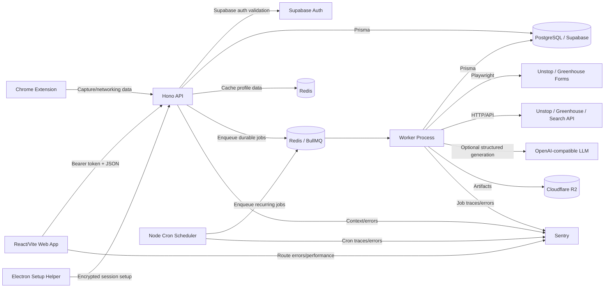
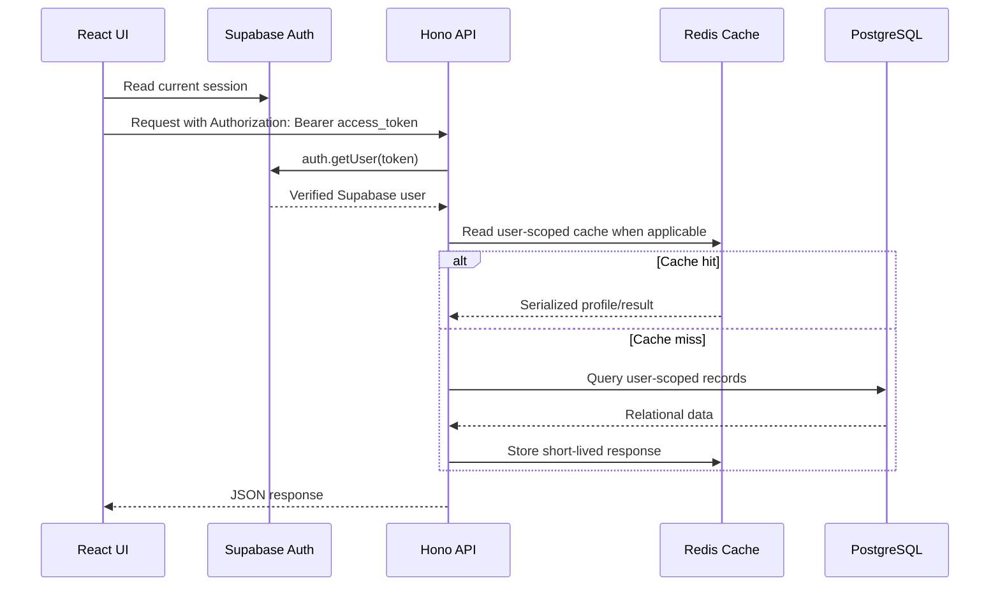
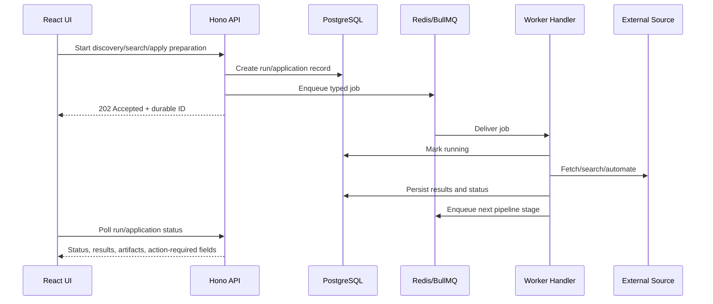

# ApplyAI Studio — Comprehensive Technical Dossier

**Author:** Manus AI  
**Audit date:** 25 August 2026  
**Repository:** `Sameer-choudhary-git/ApplyAi-turbo`  
**Audited branch:** `job-skill`  
**Audited revision:** `07e7fa9`  
**Audience:** Project owner, technical interview preparation, maintainers, reviewers, and future contributors

> **Purpose of this document:** This dossier explains what ApplyAI Studio is, why it exists, how its code is organized, how requests and background jobs flow through the system, how the data model supports the product, what is implemented versus incomplete, and which technical questions an interviewer may ask.

The repository is the source of truth. Product descriptions and implementation claims in this document are grounded in the tracked source files, Prisma schema, deployment documents, and existing design notes. Where the repository contains a prototype, stub, planned provider, or operational gap, this document labels it explicitly instead of presenting it as complete.

---

## 1. Executive summary

ApplyAI Studio is a **career operations and job-automation platform**. It centralizes a candidate’s professional profile, preferences, job discovery, application tracking, interviews, tasks, reminders, networking contacts, and subscription entitlements in one workspace. Its differentiator is that job-search activity is not limited to a static listing page: the system contains background discovery, scheduled processing, browser automation, AI-assisted but constrained answer generation, application preparation, and an auditable application ledger.

The system is implemented as a **pnpm/Turborepo monorepo**. The browser frontend is a React/Vite application. The HTTP backend is a Hono service running on Node.js. Supabase provides identity and PostgreSQL is accessed through Prisma. Redis and BullMQ provide asynchronous job delivery and API caching. A long-running scheduler enqueues recurring work, while a separate worker process consumes queue messages and runs extraction, validation, browser automation, Greenhouse processing, and Job Skill workflows. Playwright is used where a browser is required, and Cloudflare R2-compatible storage holds resume and generated application-material artifacts.

At a high level, ApplyAI separates **discovery**, **decisioning**, **preparation**, and **submission**:

| Layer | Responsibility | Example |
|---|---|---|
| Discovery | Find and normalize opportunities from external sources | Unstop extraction, Greenhouse board discovery, Job Skill web search |
| Decisioning | Match opportunities to profile/preferences and enforce entitlements | Fitness score, role/location match, daily and monthly quota checks |
| Preparation | Create a reviewable application or tailored materials | Pending confirmation, resume/cover-letter DOCX, ZIP bundle |
| Submission | Perform a platform action only when consent and safety gates pass | Greenhouse Playwright autofill and optional guarded submit |
| Tracking | Preserve a durable history of what happened | `user_job_applications`, run status, artifact metadata, audit events |

The most important architectural decision is the use of **asynchronous, queue-backed workflows** for long-running work. HTTP requests create or update durable records and enqueue work; workers perform scraping, AI calls, browser automation, and file generation outside the request lifecycle. This keeps the API responsive and provides retry, status, and audit boundaries.

---

## 2. The product problem and product thesis

Job seekers typically have to combine several disconnected tools: job boards, spreadsheets, resumes, cover-letter generators, calendars, reminders, networking notes, and browser automation. The result is fragmented context and repetitive manual work. ApplyAI’s thesis is that a candidate’s profile and preferences should become a reusable operating context that can power discovery, matching, preparation, follow-up, and reporting.

The product therefore treats a candidate profile as a **source of truth**, not merely an onboarding form. Name, contact information, links, location, education, experience, skills, resume, role keywords, work modes, target locations, platform preferences, and automation settings are later consumed by discovery, scoring, application preparation, calendar synchronization, and browser agents.[5]

The platform also treats automation as a **controlled workflow**, not as an unrestricted bot. For example, Greenhouse discovery is public and credential-free, while applying is separated behind an explicit user confirmation and safety gate. Unknown legal, demographic, consent, work-authorization, or sensitive questions are not guessed; they become `action_required` for the user.

### Product goals

ApplyAI is designed to:

1. Give the user a single workspace for the complete job-search funnel.
2. Discover opportunities from multiple sources rather than repeatedly exposing only one fixed company list.
3. Reduce repetitive extraction, matching, application preparation, and follow-up work.
4. Make automation observable through statuses, counts, run history, artifacts, and audit metadata.
5. Enforce user and plan limits before work is allowed to expand.
6. Preserve user control for sensitive or ambiguous application questions.
7. Remain extensible through shared configuration, queue jobs, platform registries, and provider abstractions.

### Non-goals and boundaries

The current system is not a guaranteed global index of every employer or job. Greenhouse board-token discovery uses configured seeds, public career-page links, sitemaps, retained boards, and optional Common Crawl results; coverage is therefore broadening and probabilistic rather than exhaustive. The Job Skill provider registry exposes several future provider names, but only the Unstop database provider and the configurable web-search provider are currently implemented in the worker provider registry. Several older platform paths are also incomplete, particularly Commudle extraction and LinkedIn feed analysis.

---

## 3. System design at a glance

### 3.1 High-level architecture



The browser is not expected to perform the long-running discovery or automation itself. It initiates commands, reads status, renders progress, and allows the user to review or continue action-required work. The backend persists durable state, and the worker executes the expensive or fragile steps.

### 3.2 Synchronous request flow



Every protected request begins with server-side token validation. The middleware places `supabaseUser` and `userId` into Hono context. Route handlers then scope Prisma queries to that user ID. The frontend API helper obtains the current Supabase session for each request and attaches the access token.[2]

### 3.3 Asynchronous job flow



The system uses **at-least-once delivery semantics**. A queue message may be retried, so durable uniqueness constraints, idempotency keys, stable external identifiers, and status checks are necessary. The code does not claim exactly-once execution; it makes repeated delivery safe at important business boundaries.

---

## 4. Monorepo organization

The root workspace is managed by pnpm and Turbo. The workspace definition includes `apps/*`, `packages/*`, and nested `packages/*/*` workspaces. Root scripts orchestrate development, generation, builds, linting, type checking, tests, and formatting.[1]

### 4.1 Applications

| Application | Runtime role | Key responsibilities |
|---|---|---|
| `apps/web` | Browser frontend | React routes, auth state, dashboard UI, forms, status polling, loading and error states |
| `apps/api` | HTTP API | Hono route composition, auth middleware, Prisma reads/writes, cache, entitlements, queue enqueueing |
| `apps/worker` | Background worker | BullMQ consumers, extraction, validation, application agents, Playwright, Job Skill pipeline, artifact generation |
| `apps/scheduler` | Long-running cron process | Enqueues daily, hourly, five-minute, Greenhouse, and user-configured Job Skill work |
| `apps/applyAi-desktop` | Electron helper | Opens a visible browser for Unstop login, captures storage state, encrypts it, and sends it to the API through a deep-link setup flow |
| `apps/chrome-extension` | Chrome Manifest V3 extension | Captures LinkedIn profile context for the networking workspace and can send it to ApplyAI |

### 4.2 Shared packages

| Package | Responsibility | Architectural value |
|---|---|---|
| `@applyai/config` | Environment resolution, API origin, endpoint constants, storage/encryption settings, platform configuration | Prevents duplicated configuration and drives data-driven platform UI |
| `@applyai/contracts` | Typed payloads for extraction, validation, application, and queue boundaries | Gives shared names and shapes to asynchronous messages |
| `@applyai/db` | Prisma schema, migrations, generated client, PostgreSQL adapter | Central persistence boundary shared by API, worker, and scheduler |
| `@applyai/jobs` | `BaseJob`, job names, enqueueable job classes | Keeps queue dispatch consistent across producers |
| `@applyai/queue` | Redis connection, BullMQ queue factory, worker factory, worker lifecycle, Sentry worker wrapper | Centralizes delivery, retry, concurrency, and failure behavior |
| `@applyai/core/greenhouse` | Greenhouse candidate discovery, board/job normalization, persistence, limits, selection | Domain logic independent of HTTP and worker wiring |
| `@applyai/core/extractor` | Extractor registry and platform collectors | Encapsulates browser-based source ingestion |
| `@applyai/core/validation` | Listing validation and lifecycle decisions | Separates stale/expired record handling from extraction |
| `@applyai/core/apply` | Platform agent registry and application-related types | Defines the direction for platform application agents; the general service class remains sparse |
| `@applyai/utils` | Encryption and R2-compatible object storage helpers | Reusable handling for sessions and generated artifacts |
| `@applyai/logger` | Pino request/application logging | Structured operational logging |
| `@applyai/sentry` | Sentry setup helpers and environment utilities | Standardizes observability initialization |
| `@applyai/error-tracking` | Vendor-neutral strategy abstraction | Allows Sentry to be replaced or supplemented without changing business code |
| `@applyai/validation` | Validation package and Unstop validator | Provides reusable listing checks |
| `@repo/ui` | Shared UI package scaffold | Common package boundary, although the main web UI also contains local shadcn-style primitives |
| `@repo/eslint-config` and `@repo/typescript-config` | Shared tooling | Keeps workspace configuration consistent |

### 4.3 Layering and dependency direction

The intended dependency direction is:

```text
Presentation: web / desktop / extension
                 |
                 v
Transport:      Hono API routes
                 |
                 v
Shared boundaries: contracts, config, jobs, queue
                 |
                 v
Domain:         greenhouse / extractor / validation / apply services
                 |
                 v
Infrastructure: Prisma/PostgreSQL, Redis, R2, Playwright, external APIs
```

A useful interview explanation is that **HTTP handlers are orchestration boundaries**, not the best place for domain algorithms. Greenhouse discovery and application matching live in `@applyai/greenhouse`, while queue jobs and workers connect those domain functions to asynchronous execution.

---

## 5. Runtime services and lifecycle

### 5.1 API service

The API entrypoint loads environment variables, initializes Sentry before other work, installs uncaught-exception and unhandled-rejection handlers, begins Redis initialization for production, and starts the Hono server on `PORT` or `3000`. Redis initialization is intentionally non-fatal for API boot: the server can continue without cache, while the health endpoint exposes Redis readiness separately from database health.[2]

The Hono composition root applies middleware in this order: Sentry context, structured request logging, secure headers, pretty JSON, and credentialed CORS. It then mounts route groups under `/api/*` and exposes `/health` and `/health/ping`. The CORS allowlist includes the production web domains, deployed Vercel origin, Chrome extension origin, and optional comma-separated `FRONTEND_URL` values.

### 5.2 Worker service

The worker process is long-running. It initializes Sentry, captures process-level failures, exports or registers the Apply, Extract, Validation, Cleanup, Notification, and Job Skill workers, and flushes Sentry during SIGTERM/SIGINT shutdown. The queue-specific worker files create consumers with registries that map job names to handler classes.

The worker has separate concurrency settings for major workloads. The apply worker uses concurrency five, extract uses concurrency two with a longer lock duration, and Job Skill uses a configurable concurrency defaulting to two with a two-minute lock. These settings should be tuned based on external rate limits, browser memory usage, and database capacity rather than increased blindly.

### 5.3 Scheduler service

The scheduler is a separate long-running Node process. It registers five recurring families:

| Schedule | Default expression | Work enqueued |
|---|---:|---|
| Daily extraction | `0 2 * * *` | Unstop extraction, Commudle extraction, and Unstop validation in parallel |
| Hourly user queue | `0 * * * *` | Eligible-user application queue |
| Five-minute dispatcher | `*/5 * * * *` | Due user-configured Job Skill runs |
| Greenhouse discovery | `15 2 * * *` | Greenhouse board/job discovery; configurable through `GREENHOUSE_DISCOVERY_CRON` |
| Greenhouse application selection | `0 4 * * *` | Daily Greenhouse matching and autofill queueing; configurable through `GREENHOUSE_APPLICATION_CRON` |

The user-configured Job Skill schedule is stored in PostgreSQL with a cron expression and timezone. The scheduler selects due rows, checks active entitlement and `scheduled_runs_per_day`, creates a nightly run with a deterministic `nightly:{scheduleId}:{date}` idempotency key, enqueues search, and computes the next run with `cron-parser`.

### 5.4 Desktop helper

The Electron application exists for a workflow that is difficult to perform safely in a headless server: linking a user’s Unstop session. It receives an `engibuddy://` deep link containing a setup token, opens Firefox visibly with Playwright, waits for the user to complete login, reads browser storage state, encrypts it with AES-256-GCM, and posts the encrypted session to the API. It does not send a raw password to the backend. It enforces required `API_ENDPOINT` and encryption-key configuration before starting.[20]

### 5.5 Chrome extension

The extension is a Manifest V3 networking assistant. It has `storage`, `tabs`, `activeTab`, and `scripting` permissions and host permissions limited to LinkedIn profile pages. Its product boundary is narrower than a general LinkedIn automation bot: it captures profile information for networking records and sends it into the ApplyAI networking workflow.[21]

---

## 6. Authentication and identity flow

### 6.1 Browser authentication

The frontend `AuthProvider` subscribes to Supabase auth state events, reads an existing session, handles OAuth callback conditions, exposes the current user, and provides logout. The top-level app renders `/login` publicly. All other routes pass through an authenticated application gate. While authentication is loading, the branded startup skeleton is displayed rather than a blank screen.

When the user is not authenticated, React Router redirects to `/login`. When the Supabase user exists but the application database has no onboarded profile, `AppShell` renders the five-step onboarding flow. This creates a clean distinction between **identity authenticated** and **product profile ready**.

### 6.2 API token validation

The browser API client calls `supabase.auth.getSession()` for each request and sends:

```http
Authorization: Bearer <supabase-access-token>
Content-Type: application/json
```

The API auth middleware rejects missing or malformed bearer headers, calls Supabase `auth.getUser(token)`, and places the verified user object and ID into Hono context. Protected routes use `c.get("userId")` and must scope database operations accordingly.

The server also creates a Supabase service-role client for server-side operations. That key must remain server-only and must never be bundled into the browser. This separation is important in an interview: the browser presents a user token, while privileged server operations use a separate secret-controlled client.

### 6.3 User synchronization and onboarding

`POST /api/auth/sync` creates the local `users` row after Supabase login if it does not already exist. `POST /api/users/onboard` performs a transactional upsert of the user record, deletes and recreates education, experience, and skills arrays, upserts preferences, and assigns the default free entitlement only when no active entitlement exists. This ensures that onboarding does not accidentally replace an admin-granted plan.

`GET /api/users/me` loads the user profile, preferences, education, experience, active platform-session indicators, and feature flags. The response is cached under a user-specific Redis key for five minutes and invalidated after onboarding or preference changes. The cache stores the serialized response rather than raw secrets.

---

## 7. HTTP API surface

The API is organized into Hono routers. The most useful way to explain it is by business capability rather than by file count.

| Capability | Main route prefix | Important operations |
|---|---|---|
| Health | `/health` | Database/Redis readiness and lightweight `/ping` |
| Auth/profile | `/api/auth`, `/api/users` | Sync identity, read profile, submit onboarding |
| Jobs | `/api/jobs` | List and read Unstop internships |
| Resume | `/api/resume` | Upload, update, and read resume metadata |
| Preferences/flags | `/api/users/me/preferences`, `/api/users/me/flags`, `/api/auth/flags` | Save targeting/automation settings and platform flags |
| Unstop session | `/api/sessions/unstop` | Request setup token, inspect status, submit encrypted session |
| Applications | `/api/applications` | List applications, change status, mark interview state, schedule follow-up |
| Tasks | `/api/tasks` | CRUD, toggle completion, priority/category/status management |
| Interviews | `/api/interviews` | CRUD interview records and application linkage |
| Schedule/reminders | `/api/schedule`, `/api/reminders` | Read calendar-oriented data and manage reminders |
| Networking | `/api/networking` | CRUD contacts, pinning, stats |
| Saved jobs | `/api/saved-jobs` | CRUD saved opportunities |
| Google Calendar | `/api/google-calendar` | OAuth connect/callback/status/disconnect |
| Job Skill | `/api/job-skill` | Providers, runs, opportunities, save/apply tracking, schedules |
| Greenhouse | `/api/greenhouse` | Discovery listing/status, limits/settings, prepare/confirm/autofill |
| Entitlements | `/api/entitlements` | Plans, current entitlement, usage, access-code redemption |
| Admin | `/api/admin/jobs`, `/api/admin/subscription-codes` | Trigger jobs, manage customers/codes/entitlements/audit |

Most user-facing routers are protected by the shared auth middleware. Admin subscription routes apply a second `isAdminUser` gate after authentication. The Greenhouse and Job Skill routers use a router-level auth middleware so individual handlers can focus on feature behavior.

---

## 8. Persistence model

The PostgreSQL schema is defined in Prisma. It contains a mixture of normalized relational tables for core relationships and JSON columns for flexible provider settings, raw source payloads, arrays, snapshots, feature maps, and metadata.[3]

### 8.1 Entity domains

| Domain | Models | Design purpose |
|---|---|---|
| Candidate profile | `users`, `user_education`, `user_experience`, `user_skills` | Canonical identity and professional background |
| Targeting and automation | `user_preferences` | Work modes, opportunity types, platforms, role keywords, industries, caps, platform-specific JSON settings |
| Platform credentials | `user_platform_sessions`, `unstop_setup_tokens` | Encrypted session state and temporary setup handoff |
| Source catalog | `unstop_internships`, `greenhouse_boards`, `greenhouse_jobs` | Scraped or API-sourced opportunities with active/inactive lifecycle |
| Application ledger | `user_job_applications` | User-scoped application history, status, notes, interview linkage, external identifiers |
| Job Skill | `job_skill_runs`, `job_skill_schedules`, `job_skill_opportunities`, `job_skill_artifacts` | Run history, user schedules, normalized matches, generated materials and reports |
| Productivity | `user_tasks`, `user_interviews`, `task_reminders`, `user_reminders` | Follow-up tasks, interviews, reminders, and calendar relationships |
| Calendar | `user_google_calendar` | Per-user Google OAuth tokens and synchronization state |
| Networking | `user_networking_contacts`, `linkedin_scrape_queue` | Contacts, tags, relationship metadata, and extension-captured queue data |
| Monetization | `subscription_tiers`, `subscription_access_codes`, `subscription_redemptions`, `user_entitlements`, `subscription_usage`, `subscription_audit_events` | Plan definitions, redemption, overrides, quotas, and governance |

### 8.2 Important identity and uniqueness constraints

The schema uses stable user ownership relationships and indexes to support common queries. Examples include unique `(userId, skill)` for skills, unique `(userId, platform)` for platform sessions, unique `(userId, idempotencyKey)` for Job Skill runs, unique `(userId, canonicalUrl)` for Job Skill opportunities, unique `userId` for a user’s Job Skill schedule, unique `(userId, url)` for saved jobs, unique `(entitlementId, metric, periodKey)` for usage, unique Greenhouse `boardToken`, and unique Greenhouse job `externalKey`.

These constraints are more than schema housekeeping. They are part of the reliability model. A retried worker can upsert a canonical opportunity instead of creating a duplicate, and a repeated scheduled run can be recognized through its idempotency key.

### 8.3 JSON columns and tradeoffs

JSON fields make the product extensible without adding a migration for every platform-specific option. They are used for skills/tags, raw source payloads, platform settings, plan feature maps, limit maps, snapshots, and application metadata. The tradeoff is that JSON fields are less strongly typed and harder to query/index than first-class relational columns. A future scaling pass should promote frequently filtered fields into typed columns or generated indexes.

### 8.4 Lifecycle semantics

Source records are generally **marked inactive instead of deleted** when a successful refresh no longer returns them. Greenhouse is explicit about this: after a successful board refresh, existing board jobs are marked inactive before current jobs are upserted. A failed board request does not deactivate the board’s existing jobs. This preserves history and prevents a transient upstream failure from erasing useful data.

---

## 9. Caching, queues, and Redis

Redis serves two related but conceptually separate purposes:

1. **API cache:** The API cache adapter uses `REDIS_URL`, with a `REDIS_HOST`/`REDIS_PORT` fallback. User profiles are cached for five minutes, and writes invalidate user-specific patterns.
2. **BullMQ transport:** The shared queue connection prefers `REDIS_QUEUE_URL`, then falls back to `REDIS_URL`, and finally supports host/port configuration. This permits a deployment to use one Redis endpoint or to separate cache and queue endpoints later.

The cache adapter catches cache read/write/delete errors and returns a safe miss or no-op. The API health response reports `redis: connected`, `unreachable`, or `disabled`, while database readiness controls whether the health status is `ok` or `degraded`.

The queue layer centralizes `QueueService`, queue creation, job addition, worker construction, completion/failure logging, concurrency, and Sentry instrumentation. Job classes extend `BaseJob`, which forwards a queue name, job name, payload, and BullMQ options to the queue service.[11]

A strong interview answer should distinguish **cache failure from queue failure**. If the API cache is unavailable, the API can still query PostgreSQL. If the queue Redis is unavailable, long-running work cannot be reliably dispatched and workers should fail visibly rather than pretend that a job was accepted.

---

## 10. Feature deep dives

## 10.1 Onboarding and profile foundation

The onboarding page is a five-step workflow: profile, education, experience, preferences, and review. It collects the data that downstream automations need: name and contact information, location, professional links, resume, education, experience, skills, target work modes, opportunity types, platforms, and optional access code.

On completion, the frontend submits the structured profile to `/api/users/onboard`, uploads the resume through `/api/resume/upload` when necessary, optionally redeems an access code, invalidates the profile query, and navigates into the workspace. The backend writes the main user and nested profile tables in a transaction.

This architecture prevents a half-written candidate profile from being visible to automation. It also explains why onboarding is a gate: a user can authenticate with Supabase, but the product does not begin discovery or application work until the local profile is complete.

## 10.2 Unstop discovery and application path

The legacy Unstop path is a source extraction and browser-agent workflow:

```text
Daily scheduler
  -> ExtractUnstopInternshipsJob
  -> extract worker
  -> Unstop Playwright extractor
  -> unstop_internships
  -> validation job
  -> eligible-user/application queue
  -> Unstop browser agent
  -> user_job_applications
```

The extraction service runs the Unstop extractor and writes records with `createMany(..., skipDuplicates: true)`. The validator can mark stale or expired records inactive. The Unstop application service loads the user’s preferences, skills, active encrypted platform session, entitlement, and platform flag. It decrypts the session, chooses the `unstop` agent from the registry, runs the browser workflow, and writes application results.

This path depends on a user-linked browser session. The desktop helper supports the initial login and encrypted session handoff. The service checks a monthly entitlement limit, but the code still contains a TODO concerning unified apply-limit and cooldown enforcement. This is an important example of an implemented path that still needs consolidation before it is described as production-perfect.

## 10.3 Greenhouse discovery

Greenhouse discovery is intentionally independent from candidate login. The core service finds candidate board tokens through:

- Configured seed URLs in `GREENHOUSE_SEEDS`.
- Direct Greenhouse board URLs.
- Public career pages and extracted links.
- `robots.txt` and sitemap URLs.
- Previously retained valid boards.
- Optional bounded Common Crawl index queries.

Candidate URLs are normalized by removing tracking parameters and fragments. Board tokens are validated against a constrained format and Greenhouse hosts. A valid candidate is fetched from the public Greenhouse Job Board API with `content=true`. The service normalizes each job into a stable record including title, company, location, department/office arrays, publication timestamps, HTML/text description, source metadata, and a deterministic key:

```text
greenhouse:{boardToken}:{greenhouseJobId}
```

The discovery run persists counts for candidate boards, valid boards, failed boards, jobs seen, new jobs, and updated jobs. Board refreshes are bounded by a worker count with a default of six and a maximum of twelve. The resulting `greenhouse_jobs` table is exposed through a paginated API and the web discovery page.

The important product distinction is that discovery expands over time but cannot guarantee global coverage. Greenhouse does not provide a documented global public board directory, so discovery coverage depends on public signals and retained history.[18]

## 10.4 Greenhouse application preparation and autofill

Greenhouse applications begin in a controlled state. Preparing a job creates a `user_job_applications` record with status `pending_confirmation`, the external job key, Greenhouse metadata, and a note that the application is prepared for manual confirmation.

A user confirmation moves the record to `autofill_queued`. The worker then opens the public company-hosted application form with headless Chromium and inspects visible form controls. It maps verified fields from the candidate profile:

| Form field category | Source |
|---|---|
| First/last/full name | `users.fullName` |
| Email | Auth-linked `users.email` |
| Phone | `users.phone` |
| LinkedIn/GitHub | Profile URLs |
| Location/city | `users.location` |
| Resume/CV | `users.resumeUrl` downloaded to a temporary file |
| Other non-sensitive required questions | Optional constrained answer model |

The worker never sends sensitive or legal questions to automatic answer generation. Terms covering work authorization, visa, sponsorship, citizenship, gender, race, disability, medical information, criminal history, consent, agreement, and related topics are explicitly blocked. Unresolved required fields are stored with field names, reasons, options, and optional suggested answers.

The optional answer model must return structured JSON and can answer only when `canAnswer=true`, the confidence is at least `0.75`, and the question is not sensitive. The prompt forbids inventing employers, dates, degrees, skills, work authorization, demographics, compensation, or personal history. If the model fails, the form remains action-required rather than silently receiving a guess.

Automatic submission requires all of the following:

1. The worker receives `submit: true`.
2. `GREENHOUSE_AUTO_SUBMIT=true` is configured server-side.
3. The user has enabled Greenhouse `autoSubmit=true` in preferences.
4. No required field remains unresolved.
5. A submit control is present on the form.

The final state is `applied` when submission succeeds, `ready_to_submit` when the form is filled but the final submit gate is not enabled, or `action_required` when the user must answer or review something. Metadata records the Greenhouse tag, optional `action_required` tag, field provenance, unresolved fields, whether submission occurred, and completion time.[7] [8]

## 10.5 Job Skill discovery

Job Skill is a **discovery and matching capability**, not the same thing as Greenhouse auto-apply. It lets a user search for roles across multiple sources, rank opportunities against the profile, save a match, track it as an application, and optionally generate application materials.

### API lifecycle

`POST /api/job-skill/runs` performs the following:

1. Requires the `job_skill_search` feature entitlement.
2. Reads requested roles, locations, providers, seniority, salary bounds, result limit, and material limit.
3. Falls back to preference roles when explicit roles are absent.
4. Validates that at least a role or location exists.
5. Clamps requested limits to entitlement limits.
6. Creates a run with profile, preference, configuration, and entitlement snapshots.
7. Uses a supplied idempotency key or creates a unique manual key.
8. Enqueues `JobSkillSearchJob` and returns HTTP `202`.

The snapshot design is deliberate. A long-running run should be reproducible against the profile and limits that existed when it began, rather than silently changing behavior halfway through execution.

### Provider strategy

The provider registry currently implements:

- `unstop`: queries active `unstop_internships` rows through Prisma.
- `web_search`: calls a configurable Tavily-compatible endpoint, defaults to a broad domain list, normalizes results, and deduplicates them.

The web provider can search domains such as LinkedIn, Naukri, Instahyre, Cutshort, Hirist, Indeed, Foundit, Shine, TimesJobs, Glassdoor, Wellfound, We Work Remotely, Greenhouse, Lever, Ashby, and Workable. The allowed provider list is broader than the active registry, so provider names such as `linkedin`, `naukri`, or `company_careers` are currently an extension point rather than separate native implementations.

### AI role expansion and deterministic scoring

If configured, an OpenAI-compatible model expands role keywords into up to six concise aliases. The system then creates bounded role/location search queries. AI is used for query expansion, not as the sole source of truth for matching.

Each normalized result receives a score from zero to one hundred. The current deterministic weighting is approximately:

| Signal | Maximum contribution |
|---|---:|
| Profile skill overlap | 55 |
| Role-title alignment | 20 |
| Location alignment | 15 |
| Project/profile token overlap | 10 |

The system returns both a score and a human-readable reason, such as how many skills matched, whether the role aligned, and whether location may differ. This explainability is valuable in interviews because it avoids presenting an opaque “AI says match” result.

### Job Skill worker pipeline

```text
JobSkillSearchJob
  -> searchProviders()
  -> canonical URL deduplication
  -> scoreOpportunity()
  -> upsert job_skill_opportunities
  -> if high-scoring results + material limit:
       JobSkillMaterialsJob
       -> DOCX resume + DOCX cover letter + ZIP
       -> R2 artifacts
  -> JobSkillReportJob
       -> Markdown report
       -> R2 artifact
       -> run completed
```

The search handler marks the run `running`, persists opportunities, captures provider failures in `errorSummary`, updates counts, and chooses whether to enqueue material generation or reporting. Materials are generated using deterministic templates with optional LLM tailoring restricted to facts in the profile. Each artifact receives a storage key, public URL when available, content type, and SHA-256 checksum.

The `POST /opportunities/:id/apply` operation creates a `user_job_applications` row with status `applied` and links it back to the opportunity. In the current implementation, this is **application tracking**, not a general provider-specific form submission. This distinction should be stated clearly in an interview.

## 10.6 Applications and pipeline tracking

Applications are stored in a generic ledger with platform, external job key, title, company, link, status, notes, type, location, deadline, timestamps, interview state, and JSON metadata. The Applications page supports search, status filtering, type filtering, status changes, and interview scheduling.

The dashboard derives headline metrics such as applications sent today, interviews scheduled today, pending applications, and replies today from application and interview records. The application ledger is the integration point that lets Greenhouse, Unstop, and Job Skill results appear in the same pipeline while retaining platform-specific metadata.

## 10.7 Tasks, interviews, reminders, and schedule

The productivity domain gives the user a lightweight career operating system around applications. Tasks have priority, status, category, source, due date, completion timestamp, optional Google event ID, and reminders. Interviews can link to an application and store company, round, time, duration, meeting URL, timezone, notes, status, and Google Calendar synchronization identifiers.

Reminders exist in both task/interview reminder relations and the flexible `user_reminders` model for custom calendar events. The schedule UI combines tasks, interviews, reminders, and application follow-ups. Google Calendar synchronization uses OAuth2, persists access/refresh tokens per user, refreshes tokens when needed, and creates or updates remote events while storing their IDs locally.[19]

## 10.8 Networking and LinkedIn capture

The networking domain stores contacts with name, title, company, email, profile URL, platform, pinned state, relationships, status, notes, referral potential, and tags. The frontend provides a networking workspace with search/filtering, stats, pinning, and CRUD interactions.

The Chrome extension captures LinkedIn profile information in the browser and is designed to feed the networking app rather than act as a general-purpose auto-apply bot. A `linkedin_scrape_queue` table exists for structured raw data that can be processed asynchronously.

## 10.9 Saved jobs

Saved jobs are user-scoped records with title, company, URL, location, work mode, stipend, type, source, notes, description, deadline, and status. The unique `(userId, url)` constraint prevents the same user from saving one URL repeatedly. Job Skill save operations use a transaction to create or reuse a saved job and then link the opportunity.

## 10.10 Plans, entitlements, and administrative control

ApplyAI uses a data-driven subscription model rather than hard-coding all feature gates in the frontend. Tiers contain JSON feature maps and limit maps. User entitlements snapshot the tier state and may add feature or limit overrides. Effective features and limits are resolved by merging tier defaults, snapshots, and overrides.

The main user subscription capabilities are:

- List public active plans.
- Read the current effective entitlement.
- Read monthly usage metrics.
- Redeem a normalized, hashed access code.

The access-code redemption transaction verifies the code, checks expiry/revocation/redemption capacity, makes an existing active entitlement replaced, creates a redemption and new entitlement, and writes an audit event. Repeating the same user/code redemption returns the existing entitlement idempotently.

The admin control plane can list plans/customers/codes, generate codes with feature/limit overrides, directly assign a tier, patch or revoke entitlements, inspect customer audit history, and revoke codes. Admin-only behavior is guarded by `isAdminUser` after normal authentication.

Usage reservation is concurrency-aware. `reserveUsage` uses a PostgreSQL `INSERT ... ON CONFLICT DO UPDATE` statement whose update succeeds only when `used + amount <= limit`. This prevents two concurrent API requests from both observing remaining quota and overshooting it.

---

## 11. AI architecture and safety boundaries

AI appears in three bounded roles:

| AI role | Input | Output | Safety posture |
|---|---|---|---|
| Job Skill role expansion | User roles, locations, seniority | Short alias list | Structured JSON, limited count, no employers or unrelated roles |
| Greenhouse form answer drafting | Candidate profile, job context, unresolved non-sensitive questions | `canAnswer`, answer, confidence, reason | No invention; sensitive/legal/consent questions blocked; threshold `>= 0.75` |
| Job Skill material tailoring | Candidate profile and opportunity | Resume summary and cover letter | Uses only profile facts; deterministic fallback if unavailable |

A good design explanation is that the model is **not trusted with authority**. It proposes text or search aliases within a constrained contract. Deterministic code decides whether the output is eligible, whether a field is sensitive, whether confidence is sufficient, and whether submission is allowed.

A future hardening step should also treat external job descriptions and search snippets as untrusted prompt content. The current prompts constrain the requested output, but a production-grade implementation should explicitly delimit source text, strip instructions from retrieved content, validate output against profile facts, cap input sizes, log model metadata without candidate secrets, and add adversarial tests for prompt injection.

---

## 12. Observability and error tracking

ApplyAI has a vendor-neutral error-tracking abstraction in `@applyai/error-tracking`. The strategy pattern exposes a shared interface for capturing exceptions/messages, setting users, adding breadcrumbs, and creating transactions. The repository includes Sentry as the production strategy, a null strategy for tests or disabled environments, and templates for alternative providers.[17]

Observability is integrated at multiple layers:

| Layer | Instrumentation |
|---|---|
| API | Initialization, request context, errors, uncaught exceptions, Redis initialization failures |
| Worker | Job transactions, attempt/status context, completed/failed events, process-level errors |
| Scheduler | Cron execution IDs, durations, success/failure, breadcrumbs |
| Web | Error boundaries, route tracking, user context, performance, session replay configuration |
| Desktop | Deep-link flow, browser steps, encryption, API handoff, graceful shutdown |

The health route returns uptime, memory, environment, version, database status, Redis status, and timestamp. `/health/ping` is deliberately lightweight and skips the database check for load-balancer probes.

The most useful operational dashboards should track: API error rate and latency, queue depth, job age, failed/retried jobs, provider failures, Greenhouse boards failed, Greenhouse jobs discovered/updated, Job Skill run completion time, action-required rate, Redis readiness, database connection health, browser memory, and model error rate.

---

## 13. Deployment architecture

The deployment runbook describes a split environment:

| Component | Deployment target in the repository runbook | Notes |
|---|---|---|
| Frontend | Vercel | Static/browser React deployment |
| API | Render | Hono Node service |
| Scheduler | Azure VM | Long-running cron process; no public HTTP port required |
| Worker | AWS EC2 | Dockerized Playwright/browser automation |
| Redis | AWS-hosted Redis service/VM | BullMQ queue transport and API cache |
| PostgreSQL | Supabase | Database and Supabase identity platform |
| Artifacts | Cloudflare R2-compatible object storage | Resumes and generated Job Skill materials |

The repository includes `Dockerfile.scheduler`, `Dockerfile.worker`, and corresponding Docker Compose files. The worker image installs Playwright browsers, generates Prisma client code, builds the relevant package, and starts the worker. The scheduler image builds and starts the scheduler. Compose files configure environment files, memory limits, restart behavior, and log rotation.[16]

### 13.1 Environment contract

The exact secrets should be configured in Render/VM/Vercel environment settings and never committed. The important variable categories are:

| Category | Variables/examples | Used by |
|---|---|---|
| Database | `DATABASE_URL` | API, worker, scheduler, Prisma |
| Supabase | `SUPABASE_URL`, `SUPABASE_ANON_KEY`, `SUPABASE_SERVICE_ROLE_KEY` | Browser auth/API auth/server operations |
| API origin | `VITE_API_URL`, `PUBLIC_API_URL`, `API_URL` | Browser and public links |
| Cache/queue | `REDIS_URL`, `REDIS_QUEUE_URL`, optional `REDIS_HOST`, `REDIS_PORT`, `DISABLE_REDIS` | API cache, worker queue, scheduler queue |
| Storage | `R2_ENDPOINT_URL`, `R2_ACCESS_KEY_ID`, `R2_SECRET_ACCESS_KEY`, `R2_BUCKET_NAME`, `R2_PUBLIC_URL` | Resume/material storage |
| Encryption | `COOKIE_ENCRYPTION_KEY`, desktop `ENCRYPTION_KEY` | Platform-session protection |
| AI | `JOB_SKILL_LLM_API_KEY`, `JOB_SKILL_LLM_BASE_URL`, `JOB_SKILL_LLM_MODEL`, `JOB_SKILL_SEARCH_API_KEY`, `JOB_SKILL_SEARCH_API_URL` | Job Skill search/expansion/materials and Greenhouse answer drafts |
| Greenhouse | `GREENHOUSE_SEEDS`, `GREENHOUSE_COMMON_CRAWL_ENABLED`, `GREENHOUSE_COMMON_CRAWL_LIMIT`, `GREENHOUSE_WORKERS`, `GREENHOUSE_DISCOVERY_CRON`, `GREENHOUSE_APPLICATION_CRON`, `GREENHOUSE_AUTO_SUBMIT` | Discovery and guarded application workflow |
| Google | `GOOGLE_CLIENT_ID`, `GOOGLE_CLIENT_SECRET`, `GOOGLE_REDIRECT_URI` | Calendar OAuth and synchronization |
| Observability | `SENTRY_DSN`, environment/sampling settings | API, worker, scheduler, web, desktop |

The API cache reads `REDIS_URL`. The queue connection prefers `REDIS_QUEUE_URL` and now falls back to `REDIS_URL`, so a shared Render Redis endpoint can support both cache and queue consumers. In production, `DISABLE_REDIS` should not be `true`. The API `/health` response reports whether Redis is actually ready rather than merely checking that the variable exists.

### 13.2 Manual deployment flow

The documented workflow is intentionally simple: edit and test locally, commit and push, SSH to the VM, pull the new revision, rebuild the relevant Compose service, restart, and inspect logs. The long-term improvement should be CI/CD with schema migration gating, package-specific builds, image publishing, deployment promotion, and rollback support.

### 13.3 Runtime version caveat

The root package declares Node 24 as the intended engine, while older deployment documentation notes Node 20-slim base images in service Dockerfiles. This should be aligned or explicitly tested. Interviewers may ask about “works locally but not in production”; runtime drift is a credible risk and should be addressed by pinning the same major version in local development, CI, and containers.

---

## 14. Security and privacy model

ApplyAI processes highly sensitive career and identity data. The most important security properties are:

### Identity and authorization

The API validates Supabase access tokens server-side rather than trusting a user ID from the request body. User-scoped route handlers query by the authenticated context ID. Admin subscription routes apply an additional allowlist/administrator check.

### Secret separation

The Supabase service-role key, Redis credentials, storage keys, encryption keys, AI keys, Google OAuth secrets, and Sentry DSN belong in server-side environment configuration. The frontend should receive only browser-safe values such as the Supabase URL/anonymous key and API origin.

### Platform-session protection

Unstop browser storage state is encrypted on the desktop helper using AES-256-GCM before being sent to the API. The database stores the encrypted cookie/state string. The decryption key must be controlled separately from the database. Logs should never include raw cookies, access tokens, passwords, or storage state.

### File storage

Resumes and generated DOCX/ZIP artifacts are stored in object storage, while the database stores URLs, keys, content types, and checksums. This avoids putting large document bytes into PostgreSQL. Access-control policy for public versus signed URLs should be reviewed carefully because a public URL can expose personal documents.

### Browser automation safety

Greenhouse automation is separated into discovery, preparation, confirmation, autofill, and optional submit. Sensitive fields are blocked. Unknown required fields become action-required. The worker records provenance so the system can explain whether a value came from a verified profile field or an AI draft.

### Data minimization and logging

Error tracking and structured logs should redact authorization headers, cookies, API keys, access tokens, and sensitive query parameters. The system’s Sentry documentation describes redaction utilities and safe context patterns. Candidate profile text and job descriptions should be truncated before model calls and should not be copied into operational logs.

### Security gaps to address

A mature production hardening pass should add request rate limiting, explicit body-size limits, CSRF strategy where cookies are used, stricter schema validation for every JSON route, signed/private artifact URLs where appropriate, rotation procedures, secret scanning in CI, dependency scanning, browser sandbox policies, provider-specific terms-of-service review, and prompt-injection tests for external content.

---

## 15. Reliability and consistency model

### At-least-once processing

BullMQ retries failed jobs, so handlers must be safe when invoked more than once. The code uses upserts, status checks, deterministic external keys, and idempotency keys in the most important workflows. However, an interviewer may correctly observe that exactly-once side effects at an external website are impossible to guarantee solely through a queue; the system must combine a database claim with an external idempotency signal where the platform supports one.

### Retry classification

Network and transient upstream failures are reasonable retry candidates. Invalid configuration, missing required user data, sensitive questions, consent failures, and confirmed duplicates should not be blindly retried. The Greenhouse form flow stores action-required states instead of treating them as transient errors.

### Cache degradation

The API can continue to serve profile data from PostgreSQL if Redis is unavailable. Cache errors become safe misses or no-ops. This is a graceful degradation choice, but queue Redis failure is more serious because background work cannot be accepted reliably. Health checks expose the distinction.

### Quota consistency

Monthly subscription usage uses an atomic PostgreSQL conditional update. Greenhouse daily limits use overall and platform counts, with each platform cap constrained to twelve. The product model is hierarchical: platform limits such as `u`, `v`, `a`, and `b` must fit within a user-level global cap `X`. The final claim point should remain the authoritative enforcement location as the system scales.

### External-system brittleness

Browser automation can fail because a form changes, a selector disappears, a CAPTCHA appears, a site rate-limits the worker, a session expires, or a page loads differently. A robust implementation should classify failures, capture screenshots/HTML only under a safe privacy policy, maintain selector adapters per platform, and convert unrecoverable cases to action-required rather than repeatedly hammering the source.

---

## 16. Testing and validation strategy

The repository uses package-level build and type-check scripts coordinated by Turbo. The most relevant checks are:

```bash
pnpm --filter @applyai/web lint
pnpm --filter @applyai/web build
pnpm --filter @applyai/api check-types
pnpm --filter @applyai/api build
pnpm --filter @applyai/queue check-types
pnpm --filter @applyai/greenhouse build
pnpm --filter @applyai/greenhouse check-types
pnpm check-all
```

The frontend refinement work validated the web lint and production build. The project should add or expand automated tests around the business invariants that matter most:

| Test area | Examples |
|---|---|
| Authentication | Reject missing/invalid bearer tokens; ensure user IDs come from Supabase identity |
| Onboarding | Transaction rollback; active paid entitlement not replaced by free tier |
| Entitlements | Feature merge precedence; unlimited limits; concurrent quota reservation |
| Job Skill | Canonical URL deduplication; idempotent run creation; provider failure isolation; score calculation |
| Greenhouse | Board-token normalization; successful refresh deactivates missing jobs; failed refresh preserves old jobs |
| Application limits | Global and platform cap enforcement under concurrent selection |
| Autofill | Sensitive-field classification; verified-field mapping; unresolved-field status; submit gate |
| Queue behavior | Retry configuration, repeated delivery, failed handler status persistence |
| Security | Secret redaction, artifact access policy, payload-size limits, prompt-injection fixtures |
| Frontend | Auth loading, onboarding gate, mobile layout smoke tests, skeleton-to-content transitions |

Browser-level tests should use controlled test pages or fixtures rather than live job boards. Live providers change frequently and can introduce rate limits or legal/terms-of-service concerns.

---

## 17. Current implementation status: implemented versus incomplete

This table is intentionally candid. It is better interview preparation to know the boundary than to overclaim.

| Area | Current state |
|---|---|
| React/Vite dashboard | Implemented with authenticated routes, shared layout, responsive navigation, error boundaries, and skeleton loaders |
| Supabase authentication | Implemented for browser sessions and server token validation |
| PostgreSQL/Prisma persistence | Implemented with broad schema and migrations |
| Redis cache | Implemented with graceful fallback and health visibility |
| Redis/BullMQ queueing | Implemented with shared queue/job abstractions and worker registries |
| Sentry observability | Implemented across API, worker, scheduler, web, desktop, and extension support; provider abstraction exists |
| Onboarding/profile/resume | Implemented, including transactional relational writes and object-storage references |
| Unstop extraction | Implemented as a Playwright-backed path with persistence and duplicate skipping |
| Unstop validation | Implemented as a domain/worker path, with legacy limitations to review |
| Unstop browser application | Implemented through a platform agent and encrypted session state; limit/cooldown logic needs consolidation |
| Greenhouse discovery | Implemented with hybrid candidate discovery, board/job persistence, active lifecycle, scheduled job, and API/UI |
| Greenhouse preparation | Implemented with pending-confirmation records and limits |
| Greenhouse Playwright autofill | Implemented with field inspection, verified mapping, resume upload, safety classification, and action-required states |
| Greenhouse automatic submit | Implemented behind server and user gates; should remain operationally disabled until thoroughly tested and authorized |
| Job Skill Unstop provider | Implemented |
| Job Skill web-search provider | Implemented through configurable Tavily-compatible API |
| Job Skill AI role expansion | Optional and implemented |
| Job Skill scoring | Deterministic and explainable |
| Job Skill generated materials | Implemented with DOCX/ZIP/R2 artifact flow and optional tailoring |
| Job Skill reports | Implemented as Markdown artifacts stored in R2 |
| Job Skill provider names beyond registry | Allowed/configurable names exist, but native implementations are not all present |
| Commudle extraction | Registry exists, but the active extraction method is currently empty |
| LinkedIn feed analysis | Data structures and extension support exist; a complete end-to-end feed-analysis route is not evident in the current main API surface |
| General `@applyai/apply` service | Package/registry direction exists, but `ApplyService.ts` is sparse and platform logic is still distributed among agents/services |
| CI/CD | Manual deployment runbook exists; a mature automated promotion pipeline is a future improvement |
| Root README | Still resembles the original Turborepo starter and should be replaced with product-specific documentation |

---

## 18. Recommended engineering roadmap

### Priority 0: Correctness and production safety

First, align Node versions across root package metadata, CI, Docker images, and deployment hosts. Add end-to-end smoke tests for API health, login/session validation, onboarding, queue enqueueing, and Greenhouse preparation. Ensure every JSON route uses schema validation rather than ad hoc casts. Keep Greenhouse auto-submit disabled by default until external authorization, terms review, and test coverage are complete.

Next, consolidate application-limit enforcement. The Unstop path, Greenhouse path, scheduler, and worker should share one final claim service so overall and platform caps cannot drift. Add a database-level user/job claim or a uniqueness constraint that makes overlapping daily runs safe.

### Priority 1: Operational scale

Introduce queue metrics, distributed run locks, dead-letter/reconciliation workflows, provider rate-limit handling, and per-provider circuit breakers. Replace broad Redis `KEYS` invalidation with a production-safe key strategy or scan-based deletion. Add structured job-run records for all recurring workflows, not only Greenhouse and Job Skill.

### Priority 2: Provider architecture

Create a formal provider interface for discovery, normalization, and optional application capabilities. Keep “provider configured” separate from “provider implemented.” This prevents the UI from advertising providers that only exist as allowlist names. Add adapters for the highest-value sources one at a time with contract tests.

### Priority 3: AI and trust

Add a model gateway with timeout, retry, token budget, model/version metadata, structured-output validation, and prompt-injection defenses. Store only the minimum model audit information necessary to reproduce a decision. Add user-visible “why this match” and “what the AI drafted” explanations.

### Priority 4: Product experience

Improve run progress from simple polling to an event or status-stream model if scale requires it. Add a unified automation center showing discovery runs, queue status, application outcomes, action-required questions, and plan usage. Replace the generic root README with this dossier’s executive summary and a quick-start guide.

---

## 19. Interview-ready explanation

### 19.1 Thirty-second answer

> ApplyAI Studio is a career operations platform built as a pnpm/Turborepo monorepo. The React frontend talks to a Hono API secured by Supabase bearer-token validation. PostgreSQL through Prisma stores profiles, jobs, applications, schedules, entitlements, and audit data. Redis/BullMQ decouples long-running discovery, browser automation, and AI-assisted material generation from request handling. A scheduler creates recurring work and workers consume it with retries and status tracking. The key design principle is controlled automation: discovery and preparation are automated, but sensitive or ambiguous application questions become action-required, and final submission requires explicit server and user gates.

### 19.2 Five-minute architecture answer

Start with the user journey. A candidate authenticates with Supabase, completes onboarding, and stores a canonical profile. The web app calls the Hono API with a bearer token. The API validates identity, scopes Prisma queries by user ID, applies entitlement gates, and either returns data synchronously or creates a durable run/application record and enqueues a BullMQ job.

The scheduler is a separate process that enqueues recurring extraction, validation, discovery, and application-selection work. Redis provides queue transport and caching. Workers map queue names and job names to handlers, execute platform services, use Playwright where browser automation is required, call optional structured LLM endpoints for narrowly bounded tasks, store artifacts in R2, and persist state back into PostgreSQL. The frontend reads those durable statuses and renders skeletons, progress, results, or action-required prompts.

Greenhouse is a useful example of the separation of concerns. The discovery worker finds public board tokens and job snapshots without candidate login. A matching step applies user preferences and daily limits. Preparation creates a pending-confirmation record. After confirmation, Playwright fills verified profile fields and optionally drafts non-sensitive answers. Any unknown sensitive or required field stops the flow with `action_required`; automatic submit requires both a deployment flag and a user setting.

### 19.3 Why this architecture

The architecture is appropriate because scraping, browser automation, search APIs, LLM calls, document generation, and uploads are slow and failure-prone. Keeping them out of the HTTP request prevents timeouts and allows retries. PostgreSQL provides durable business state and transactional quota enforcement. Redis/BullMQ provides asynchronous delivery. Shared packages reduce duplication while platform-specific services isolate external-system behavior.

---

## 20. Interview question bank with answer guidance

The questions below are grouped by the competency an interviewer is testing. The suggested answer direction is intentionally concise; expand it with the relevant flow and tradeoff rather than memorizing a sentence.

### Product and architecture

**1. What problem does ApplyAI solve?**  
Explain the fragmentation of job search and the product’s career-operations thesis: one profile powers discovery, matching, preparation, applications, follow-ups, interviews, networking, and reporting.

**2. What is the core architectural pattern?**  
Describe a layered monorepo with React presentation, Hono transport, Prisma persistence, Redis/BullMQ asynchronous execution, scheduled producers, worker consumers, and platform-specific domain services.

**3. Why is background processing necessary?**  
Browser automation, external search APIs, scraping, LLM calls, document generation, and uploads are slow and can fail. Returning `202` after creating a durable record keeps the API responsive and lets the UI poll status.

**4. Why use a monorepo?**  
The API, worker, scheduler, and frontend share contracts, job names, configuration, Prisma types, and domain packages. A monorepo makes coordinated changes easier, while package boundaries still isolate responsibilities.

**5. What is the difference between Job Skill and Greenhouse?**  
Job Skill is multi-source discovery, matching, scoring, saving, tracking, and optional material generation. Greenhouse is a specific public job-board discovery and controlled application-preparation/submission workflow. Job Skill’s “apply” endpoint currently creates tracking state; Greenhouse has the Playwright form workflow.

**6. What is synchronous versus asynchronous in this system?**  
Profile reads, filters, status updates, and CRUD are synchronous API calls. Discovery, extraction, browser automation, AI generation, and reporting are asynchronous BullMQ workflows.

### Authentication and security

**7. How do you authenticate API requests?**  
The browser obtains a Supabase session and sends a bearer token. Hono middleware calls Supabase `auth.getUser`, then stores the verified user and user ID in context. Routes scope Prisma queries to that ID.

**8. Why should the service-role key never reach the frontend?**  
It bypasses normal user-level restrictions and can perform privileged server operations. The browser uses the anonymous client key and user access token; the service-role client is server-only.

**9. How are platform cookies protected?**  
The desktop helper captures browser storage state, encrypts it with AES-256-GCM, sends the encrypted value to the API, and the database stores the encrypted session. The decryption key is separate from the database.

**10. What security risks exist in browser automation?**  
Session theft, accidental submission, sensitive-data leakage, changing selectors, CAPTCHAs, and untrusted page content. Mitigations include encryption, explicit consent, sensitive-question blocking, action-required fallback, secret redaction, and no credential logging.

**11. How would you protect generated resumes and cover letters?**  
Prefer private object storage with signed, short-lived URLs; authorize artifact access by user ID; avoid predictable public URLs; record checksums and content types; and never put document bytes into logs.

**12. How would you defend the LLM against prompt injection from job descriptions?**  
Treat job content as untrusted data, delimit it, remove or ignore instructions, cap size, use a strict system contract, validate JSON schema, compare outputs against verified profile facts, and require human review for sensitive or unsupported answers.

### Queues, reliability, and distributed systems

**13. Does BullMQ provide exactly-once processing?**  
No. The system should be explained as at-least-once. Retries and worker crashes can redeliver jobs, so idempotency keys, upserts, stable external IDs, status checks, and atomic claims are required.

**14. How does Job Skill avoid duplicate runs?**  
The API stores a unique `(userId, idempotencyKey)` and returns the existing run if the same key is submitted again. Scheduled runs use a deterministic schedule/date key.

**15. How does Job Skill avoid duplicate opportunities?**  
Results are canonicalized by URL and persisted under unique `(userId, canonicalUrl)`. The worker uses an upsert.

**16. How does Greenhouse avoid duplicate jobs?**  
A deterministic `greenhouse:{boardToken}:{greenhouseJobId}` external key uniquely identifies a board/job pair. Current snapshots update the same row.

**17. What happens if a Greenhouse board request fails?**  
The board is marked failed with status and error details; existing jobs are not blindly deactivated. Only a successful refresh can mark absent jobs inactive.

**18. How would you prevent two application workers from claiming the same user/job?**  
Use a database uniqueness constraint or claim table keyed by user and external job, perform the claim in a transaction, and re-check limits/status at the final claim point. A distributed lock can protect the broader run, but the database claim should remain authoritative.

**19. What should be retried?**  
Transient network errors, rate limits, and selected 5xx responses. Do not blindly retry invalid form data, sensitive unanswered questions, missing consent, confirmed duplicates, or permanent configuration errors.

**20. What happens if Redis goes down?**  
The API cache can degrade to PostgreSQL because cache operations fail safely. Queue delivery is more serious: new asynchronous work cannot be reliably accepted, so enqueue failures should be surfaced and durable records should reflect failure rather than claiming success.

**21. How would you scale workers?**  
Run multiple worker processes with queue-specific concurrency, tune browser-heavy workers separately from lightweight database workers, enforce provider rate limits, monitor queue depth and job age, and use distributed claims so horizontal scale does not duplicate side effects.

### Database and consistency

**22. Why PostgreSQL and Prisma?**  
The product needs relational integrity between users, applications, interviews, tasks, entitlements, runs, and artifacts. Prisma gives typed queries and migrations while PostgreSQL provides transactions, indexes, unique constraints, and conditional updates.

**23. Why are some fields JSON?**  
Provider raw payloads, flexible preferences, platform-specific settings, feature maps, and metadata evolve quickly. JSON avoids a migration for every provider-specific attribute, but frequently filtered fields may eventually need typed columns and indexes.

**24. How is monthly quota usage made concurrency-safe?**  
`reserveUsage` uses `INSERT ... ON CONFLICT DO UPDATE` with a `WHERE used + amount <= limit` condition, so concurrent reservations cannot both exceed the limit.

**25. Where should application limits be enforced?**  
At the final claim/submission point, not only when a scheduler selects jobs. Earlier checks improve efficiency, but the final transactional claim is the correctness boundary.

**26. What indexes matter most?**  
User-owned lookups, active/status filters, scheduled due times, canonical opportunity URLs, external Greenhouse keys, subscription usage periods, and application timestamps. Explain that indexes should follow actual query patterns and be validated with query plans.

**27. How is cache invalidation handled?**  
User/profile and saved-job writes delete user-scoped patterns. The current adapter uses Redis `KEYS` for pattern deletion; at scale, replace this with scan-based deletion or versioned cache keys.

### Greenhouse and browser automation

**28. Why not use one global Greenhouse API endpoint for every company?**  
The public board API requires a board token, and there is no documented global public board-token directory. The product uses seeds, public career pages, sitemaps, retained boards, and optional Common Crawl to discover tokens.

**29. Why separate discovery from application?**  
Discovery is public and low-risk; application submission has consent, form questions, identity data, rate limits, and legal implications. Separate schedules and statuses make the safety boundary explicit.

**30. Why does the flow start at `pending_confirmation`?**  
It gives the user an explicit consent point before opening and filling an external application form. This is safer than silently interacting with a company-hosted form.

**31. Why does the worker not answer legal or demographic questions?**  
Those fields require personal, legal, or sensitive facts that the system should not infer. Guessing could harm the candidate and create compliance risk. The correct behavior is `action_required`.

**32. What makes a Greenhouse application `applied`?**  
The request must ask to submit, the server-side gate must be enabled, the user-level setting must be enabled, no required fields may remain unresolved, and a submit control must be present and successfully clicked.

**33. What are the main failure modes of Playwright?**  
Changed markup, selectors, delayed network state, CAPTCHA, session expiry, file-upload errors, upstream outages, and browser resource exhaustion. Use bounded timeouts, structured status, selector adapters, retries only for transient conditions, and action-required fallback.

### Job Skill and AI

**34. Is Job Skill just a UI filter?**  
No. It has a worker-side provider engine, optional AI role expansion, canonical URL normalization, provider failure isolation, multi-source aggregation, deterministic scoring, explainable reasons, material generation, and report artifacts.

**35. Why use AI for role expansion but deterministic scoring?**  
Role expansion benefits from language understanding, while scoring should be predictable, testable, and explainable. This balances recall with trust.

**36. What if the search API is unavailable?**  
The provider failure is captured while other providers can continue. The run stores an error summary, and available results can still be reported.

**37. How do you constrain AI-generated application answers?**  
Use structured JSON output, an explicit no-invention prompt, sensitive-term filtering, confidence thresholding, and user action when the model cannot support a truthful answer.

**38. Why generate artifacts asynchronously?**  
DOCX creation, optional tailoring, ZIP packaging, and R2 upload can be slow. The materials handler processes only eligible high-scoring opportunities, records checksums, and lets the report stage complete independently.

### Frontend and user experience

**39. Why TanStack Query?**  
It manages server-state caching, loading/error states, invalidation, and refetching across profile, applications, tasks, interviews, and Job Skill data. It keeps server data separate from local form state.

**40. How does the frontend handle authentication and onboarding separately?**  
`AuthProvider` handles Supabase identity. `AppShell` fetches the local profile and renders onboarding until `isOnboarded` is true.

**41. Why use skeleton loaders instead of only spinners?**  
Skeletons preserve the expected content geometry, communicate progress, reduce the feeling of a frozen page, and make transitions less jarring. The shared loader system also adds `role="status"`, accessible labels, reduced-motion handling, and consistent surfaces.

**42. How is mobile responsiveness implemented?**  
The desktop layout uses a persistent sidebar at medium breakpoints and above; mobile uses a bottom navigation shell and page-level responsive grids, filters, stacked forms, full-width actions, and visible touch affordances.

**43. What should be tested on mobile?**  
Authentication, onboarding, bottom navigation, long form fields, dialogs, search filters, Greenhouse action buttons, plan cards, calendar cells, admin controls, skeleton transitions, and horizontal overflow at 320–430px widths.

### Operations and project maturity

**44. What would you monitor first in production?**  
API availability and latency, database health, Redis readiness, queue depth/age, failed/retried jobs, provider failure rates, Greenhouse run counts, action-required volume, browser memory, artifact upload failures, and LLM error/latency.

**45. What is the biggest current technical debt?**  
The codebase has some incomplete provider abstractions and duplicated legacy paths: Commudle extraction is empty, the provider allowlist is broader than the active registry, general apply orchestration is sparse, limit logic is not fully unified, and the root README still describes the original starter.

**46. What would you improve before increasing automation volume?**  
Unify final claims and limits, add run locks and reconciliation, strengthen schema validation and rate limiting, align runtime versions, add browser fixtures and contract tests, make artifacts private by default, and keep automatic submission disabled until authorization and reliability evidence exist.

**47. How would you deploy this with zero downtime?**  
Build immutable API/worker/scheduler images, run migrations as a gated step, deploy API replicas behind health checks, drain workers before replacement, roll out scheduler with a single active leader, and keep queue payloads backward-compatible during rolling upgrades.

**48. How would you explain a production incident?**  
Start with impact and timeline, identify whether the fault was API, database, Redis, provider, browser, or model, show the durable status and Sentry evidence, explain containment, then describe the corrective action and the test/monitoring change that prevents recurrence.

---

## 21. Questions the candidate should ask the interviewer

A strong project explanation should end with thoughtful questions. Examples include:

1. Which part of the system would you scale first: API throughput, queue workers, provider integrations, or database queries?
2. Would you prefer a stronger provider interface, event-driven status updates, or a unified workflow engine as the next architectural investment?
3. What reliability guarantees do you require for external application side effects, and how do you measure them?
4. How should candidate consent, data retention, and artifact access be governed in the production environment?
5. What is the expected provider coverage and rate-limit policy for job discovery?
6. Do you prefer a single shared Redis deployment or separate cache and queue Redis instances for fault isolation?
7. Which operational metrics and SLOs would be required before enabling automatic submission at scale?

---

## 22. Glossary

| Term | Meaning in ApplyAI |
|---|---|
| Board token | The Greenhouse company-specific token used to call the public jobs endpoint |
| Canonical URL | A normalized URL with tracking parameters/fragments removed for deduplication |
| Entitlement | A user’s active plan plus effective features, limits, overrides, and lifecycle status |
| Fitness score | A deterministic 0–100 Job Skill match score with an explanation |
| Job Skill run | One manual or scheduled multi-provider discovery execution |
| `action_required` | A durable state meaning the user must answer, review, or complete something |
| Material | Generated resume, cover letter, ZIP bundle, or report artifact |
| Provider | A job source or discovery strategy such as Unstop or web search |
| Queue job | A durable asynchronous message consumed by a worker handler |
| Retained board | A previously discovered Greenhouse board kept for future refreshes |
| Scheduler | A long-running process that creates recurring queue work |
| Worker | A long-running process that consumes queue jobs and executes domain operations |

---

## 23. Final assessment

ApplyAI Studio has a credible foundation for a production career-automation product. Its strongest architectural choices are the separation of HTTP requests from long-running work, the use of PostgreSQL for durable business state, shared queue/job abstractions, explicit user scoping, entitlement-aware feature gates, Greenhouse’s safety-oriented application pipeline, and a vendor-neutral observability layer.

The most important nuance is maturity classification. The platform infrastructure is broad and several workflows are implemented end to end, but some provider paths and legacy abstractions remain incomplete. A technically honest interview presentation should emphasize the working architecture while naming the remaining hardening work: unified claims and limits, provider capability discovery, runtime alignment, stronger automated tests, private artifact access, rate limiting, and production-grade browser/model safeguards.

The most defensible overall description is:

> **ApplyAI Studio is an asynchronous, multi-source career operations platform that combines a user-owned professional profile, background job discovery, explainable matching, controlled browser automation, AI-assisted document/question drafting, productivity workflows, and plan-aware governance behind a React/Hono/PostgreSQL/Redis architecture.**

---

## References

[1]: ../package.json "ApplyAI Turbo root workspace manifest"
[2]: ../apps/api/src/app.ts "API composition root, middleware, CORS, and route registration"
[3]: ../packages/db/prisma/schema.prisma "Prisma PostgreSQL schema and entity relationships"
[4]: ../packages/config/src/index.ts "Shared runtime configuration and platform feature registry"
[5]: ../apps/api/src/routes/user.ts "Onboarding transaction, profile response, and cache behavior"
[6]: ../apps/api/src/routes/job-skill.ts "Job Skill API, entitlement gates, idempotent runs, save/apply tracking, and schedules"
[7]: ../packages/core/greenhouse/src/index.ts "Greenhouse candidate discovery, job persistence, matching, limits, and selection"
[8]: ../apps/worker/src/services/greenhouse/GreenhouseAutofillService.ts "Greenhouse Playwright autofill and guarded submission pipeline"
[9]: ../apps/worker/src/services/job-skill/provider.ts "Job Skill provider aggregation, AI role expansion, normalization, and scoring"
[10]: ../apps/scheduler/src/app.ts "Scheduler orchestration and recurring schedule registration"
[11]: ../packages/jobs/src/JobNames.ts "Shared asynchronous job names"
[12]: ../apps/api/src/lib/entitlements.ts "Entitlement resolution and atomic usage reservation"
[13]: ../apps/api/src/routes/subscriptions.ts "Subscription, access-code, admin, and audit APIs"
[14]: ../apps/web/src/App.tsx "Frontend providers, route map, authentication gate, and error boundaries"
[15]: ../apps/web/src/components/layout/AppLayout.tsx "Responsive desktop sidebar and mobile navigation shell"
[16]: ../DEPLOYMENT.md "Deployment topology, Docker files, Redis, scheduler, and worker operations"
[17]: ../IMPLEMENTATION_SUMMARY.md "Cross-service Sentry and error-tracking implementation summary"
[18]: ./GREENHOUSE_AUTOMATION_DESIGN.md "Greenhouse architecture decisions, safety gates, and implementation status"
[19]: ../apps/api/src/lib/google-calendar-sync.ts "Google Calendar OAuth and event synchronization helper"
[20]: ../apps/applyAi-desktop/main.js "Electron Unstop setup helper and encrypted session handoff"
[21]: ../apps/chrome-extension/manifest.json "Chrome extension permissions and LinkedIn profile scope"
[22]: https://developers.greenhouse.io/job-board.html "Greenhouse Job Board API documentation"
[23]: https://index.commoncrawl.org/ "Common Crawl Index Server"
