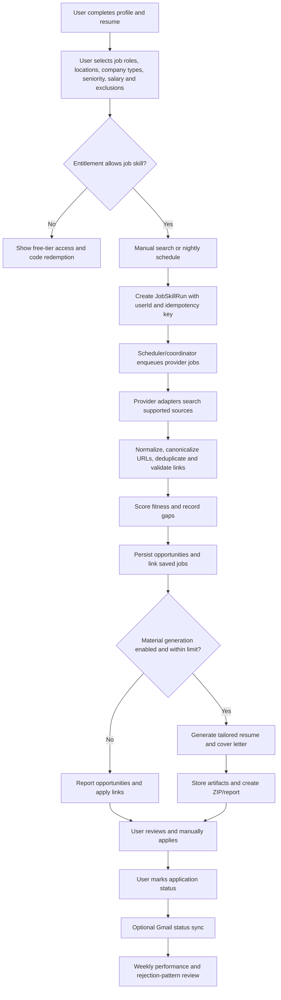

# ApplyAi Job Skill and Subscription-Code Implementation Flow

**Status:** Design proposal for review before implementation  
**Target branch:** `job-skill`  
**Base:** `feature/sentry-integration` at commit `08e66bf`  
**Reference skill:** [mayankjoshii/claude-job-skill](https://github.com/mayankjoshii/claude-job-skill)

## 1. Executive summary

The upstream repository is a Claude Skill specification rather than an executable job-search product. It defines the behavior of an assistant that learns a candidate profile, searches many job platforms, ranks opportunities, prepares tailored application materials, tracks outcomes, optionally checks Gmail, and runs a nightly search. ApplyAi already has the profile, applications, saved jobs, scheduler, worker, queue, resume storage, and admin-job foundations needed to turn those instructions into a product workflow.

The proposed implementation uses two independent but connected layers. The first is an **admin-controlled entitlement layer** with free and admin-granted tiers. It does not process payments. Admins generate secure access codes, assign each code a tier and limits, and allow a user to redeem one during onboarding or later from settings. The second is a **durable job-skill pipeline** that runs through the existing scheduler and worker services. It searches supported providers, normalizes and deduplicates results, scores fit, stores results, optionally generates application materials, and presents a reviewable report. It never submits applications or bypasses logins, CAPTCHAs, OTPs, or platform restrictions.

The first code implementation should be an MVP with a controlled provider set and explicit feature flags. The 12+ provider claim in the upstream skill should be treated as a roadmap, not as a promise to scrape every provider in the first release. Each provider must be implemented as an adapter with clear availability and failure reporting.

## 2. Design principles

> **The system prepares and organizes applications; the user remains the final submitter.**

The pipeline must be user-scoped at every API, queue, and database boundary. Every background job carries a `userId`, `runId`, and an idempotency key. The worker should be safe to retry without creating duplicate opportunities, duplicate materials, or duplicate notifications.

The system must keep two scores separate. **Fitness score** measures how well the candidate actually fits a specific role. **ATS keyword match** is an internal quality signal used while preparing a resume and should not be presented as a claim of qualification. The system must never add a skill, metric, title, employer, degree, or achievement that is not present in the user's profile or source resume.

The first release should favor traceability over silent automation. Every nightly run should record its start, provider results, failures, deduplication counts, generated artifacts, and final report. When the system changes targeting based on rejection patterns, it must explain what changed and why.

## 3. Subscription tiers without payments

### 3.1 Proposed initial tiers

| Tier | How granted | Initial capabilities | Limits |
| --- | --- | --- | --- |
| `free` | Default for every authenticated user | Profile, onboarding, saved jobs, manual application tracking, basic job browsing | No nightly job-skill automation; no bulk material generation; conservative manual-run limit |
| `job_skill` | Redeemed admin-generated code | Job-skill search, scheduled runs, normalized result history, fit scoring, saved-job integration, tailored materials within configured limits | Per-run result cap, material-generation cap, schedule frequency, and retention configurable by admin |
| `admin` | Explicit admin assignment | All available internal controls and operational actions | Reserved for internal operators; not selectable by ordinary users |

The tier names should be configuration-driven rather than hard-coded into UI conditionals. This keeps the system ready for a future payment provider without coupling billing to feature checks.

### 3.2 Access-code lifecycle

1. An authorized admin chooses a tier, maximum redemptions, expiration, optional per-user limits, and an internal note.
2. The server generates a cryptographically random code, stores only a secure hash, and displays the plaintext code once to the admin.
3. The user enters the code during onboarding or from the subscription/settings screen.
4. The server authenticates the user, hashes the submitted code, validates status, expiration, and remaining redemptions, then creates a redemption record transactionally.
5. The user's active entitlement is updated or a new entitlement record is created. Redeeming the same code again for the same user is idempotent; a code cannot be redeemed beyond its configured usage limit.
6. Revocation disables future use and can optionally end active entitlements. Historical redemption records remain auditable.

The plaintext code must not be logged or stored. The admin interface should show the code only at generation time and should provide revoke, usage, expiry, and audit views. The initial implementation can use the existing `ADMIN_USER_IDS` allowlist, but the data model should support migrating to a database-backed admin role later.

### 3.3 Proposed subscription data model

| Record | Purpose | Important fields |
| --- | --- | --- |
| `subscription_tiers` | Defines configurable capabilities | `key`, `name`, `limits` JSON, `features` JSON, `isActive` |
| `subscription_access_codes` | Stores admin-created code metadata | `id`, `tierKey`, `codeHash`, `expiresAt`, `maxRedemptions`, `redemptionCount`, `revokedAt`, `createdByUserId`, `note` |
| `subscription_redemptions` | Immutable audit trail | `id`, `codeId`, `userId`, `redeemedAt`, `tierKey`, unique `(codeId,userId)` |
| `user_entitlements` | Resolves current access | `userId`, `tierKey`, `status`, `startsAt`, `endsAt`, `limitsSnapshot`, `sourceRedemptionId` |

The API should expose `GET /api/entitlements/me`, `POST /api/entitlements/redeem`, and admin-only `GET/POST/PATCH /api/admin/subscription-codes` operations. The frontend should show the active tier and remaining limits but never expose code hashes.

## 4. Job-skill product flow

### 4.1 User-facing command and screen concepts

The web application should expose a **Job Skill** area rather than replicate the upstream slash-command syntax. The first screen should show the active tier, profile readiness, target preferences, latest run, run status, top matches, saved opportunities, and generated materials. The user should be able to start a manual run, configure a nightly schedule if entitled, pause the schedule, and open the application tracker.

The profile readiness gate should check for a resume or sufficiently complete profile, at least one target role, and at least one target location or an explicit remote/all-location choice. Missing information should be shown as a focused checklist rather than silently creating a low-quality run.

## 5. Background execution architecture

### 5.1 Recommended approach

The recommended approach is to reuse the existing scheduler → queue → worker pattern. The scheduler should only create coordinator jobs. The coordinator should load eligible users and enqueue one user-scoped run per user. Provider search, normalization, scoring, material generation, report packaging, and optional status sync should be separate worker stages.

This approach matches the current ApplyAi architecture: the scheduler already registers recurring tasks, the worker already processes extraction and application jobs, the queue package already carries named jobs, and the admin jobs route already supports manual triggers. It also allows retries and partial provider failure without blocking other users.

### 5.2 Alternatives

| Approach | Tradeoffs | Cost | Setup Complexity |
| --- | --- | --- | --- |
| Existing scheduler + worker + durable run records **(recommended)** | Best fit for per-user schedules, retries, limits, auditability, and future scale. Requires new queue payloads, worker handlers, provider adapters, and artifact handling. | No payment gateway required; uses existing infrastructure. LLM, storage, and provider quotas remain operational costs. | Medium to high |
| Admin-triggered/manual pipeline only | Fastest first slice. Users can run searches from the UI, but there is no nightly automation until a later phase and less opportunity for automatic retries. | Lowest initial operating complexity. | Low to medium |
| One monolithic nightly process | Simple to prototype, but one failure can affect all users, retries are coarse, and per-user entitlement/limits are harder to enforce. Not recommended beyond a proof of concept. | Potentially low at small scale; poor failure isolation. | Medium initially, high to maintain |

The implementation should start with the recommended architecture but deliver a manual run first, then add the nightly coordinator after the data model and worker stages are observable.

### 5.3 Proposed job stages

| Stage | Input | Output | Retry/idempotency rule |
| --- | --- | --- | --- |
| `job-skill-coordinator` | Tier-eligible user and schedule window | One `job-skill-search` per eligible user | One run per `(userId, scheduleDate, configurationHash)` |
| `job-skill-search` | User preferences and provider configuration | Raw provider result references | Provider-specific idempotency key; partial failures recorded |
| `job-skill-normalize` | Raw result references | Canonical opportunity records | Unique by `(provider, externalId)` or `(provider, canonicalUrl)` |
| `job-skill-score` | Opportunity + profile snapshot | Fitness score, reasons, gaps | Recompute only for changed opportunity/profile snapshot |
| `job-skill-materials` | Approved/top opportunities + profile snapshot | Resume, cover letter, ZIP metadata | Unique by `(runId, opportunityId, materialVersion)` |
| `job-skill-report` | Run summary + artifacts + status updates | User-visible report and notification record | One report per run; safe to retry delivery |
| `job-skill-status-sync` | Tracked applications + authorized Gmail scope | Status events and tracker updates | Store provider message IDs to avoid duplicate events |

### 5.4 Provider adapter boundary

Each provider adapter should implement a common contract such as `search(criteria)`, `normalize(rawResult)`, and `health()`. The adapter must identify its source, preserve the original URL, produce a canonical URL when possible, and return structured failure metadata. The first provider set should be chosen from sources that can be accessed reliably and lawfully in the deployment environment. Unsupported or blocked providers should be marked unavailable in the run report rather than hidden.

The system should not promise that all 12+ upstream sources are active until each adapter has link verification, rate limiting, error handling, and a test fixture. A first milestone can support the existing internal job data plus a small number of external providers, then expand the adapter registry.

## 6. Data flow and persistence

A `job_skill_runs` record should capture the user, trigger type, configuration snapshot, entitlement snapshot, status, timestamps, provider counts, material counts, and error summary. `job_skill_opportunities` should capture normalized listings, source identity, canonical URL, posting date, location, job type, description snapshot, fitness score, score explanation, and lifecycle state. A join or promotion record should connect opportunities to saved jobs and applications without duplicating the same listing.

Generated files should use the existing storage abstraction rather than local worker disk. A `job_skill_artifacts` record should store type, storage key, size, checksum, and associated run/opportunity. Reports should reference artifact metadata rather than embedding opaque local paths.

A profile/preferences snapshot should be stored on each run. This makes historical scores explainable even after the user changes their profile and prevents a retry from silently using a different profile than the original run.

## 7. Safety and user-control boundaries

The system will not submit applications, create portal accounts, solve CAPTCHAs, bypass OTPs, or operate behind a user login without an explicit supported integration. It will produce verified apply links and materials for user review. Any Gmail integration must be opt-in, limited to domains associated with tracked applications, and revocable.

The worker must enforce entitlement and per-tier limits at enqueue time and again at execution time. A disabled, expired, or revoked entitlement must prevent new work while allowing the user to view prior results. Provider requests must use rate limits, and the system must record which providers were skipped or failed.

## 8. Proposed rollout

| Release | Deliverable | Exit criteria |
| --- | --- | --- |
| 0: Documentation | This flow, research notes, decisions, and acceptance criteria | User confirms provider set and material-generation scope |
| 1: Entitlements | Tier definitions, secure code generation/redemption/revocation, onboarding/settings UI, entitlement middleware | Admin can generate/revoke a code; user can redeem once; feature access is enforced server-side |
| 2: Manual job-skill run | Run/opportunity models, provider adapter interface, one or more providers, normalization, deduplication, fitness scoring, job-skill dashboard | User can start a run and see persisted, user-scoped opportunities with explanations |
| 3: Materials and tracker | Tailored resume/cover letter pipeline, ZIP artifact storage, saved-job/application promotion | Eligible opportunities produce downloadable, traceable materials without invented claims |
| 4: Nightly automation | Scheduler coordinator, per-user limits, worker retries, report delivery, pause/resume | Entitled users receive idempotent nightly runs and visible run history |
| 5: Status and self-correction | Optional Gmail integration, status events, weekly metrics, rejection-pattern explanations | Status changes are auditable and any strategy adjustment is explained to the user |

## 9. Decisions needed before implementation

1. Which providers should be included in the first working release? The safest default is the existing internal job data plus two or three external sources with reliable access.
2. Should the first release generate DOCX resume and cover-letter files, or should it first persist and rank opportunities with material generation behind a feature flag?
3. Should nightly automation be available immediately to every redeemed `job_skill` code, or should admins be able to enable it per code?
4. Should Gmail status synchronization be included in the first release, or deferred until the search and material pipeline is stable?
5. What result, material, and run-frequency limits should the initial `job_skill` tier use?
6. Should admins manage codes through a web screen, or is an authenticated admin API sufficient for the first slice?

## References

[1]: https://github.com/mayankjoshii/claude-job-skill "mayankjoshii/claude-job-skill repository"
[2]: https://github.com/mayankjoshii/claude-job-skill/blob/main/SKILL.md "Upstream job-skill behavior specification"
[3]: https://github.com/Sameer-choudhary-git/ApplyAi-turbo "ApplyAi-turbo repository"
